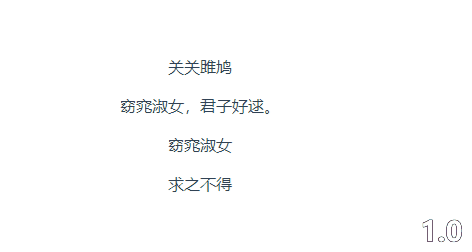

# v-tips

> 考虑到各个组件库针对`tooltip`组件都是在需要显示节点多包一层`tooltip`组件,感觉不是很方便,感觉用上指令会更合理.

## 基本用法

```vue
<template lang="pug">
  .box1(v-tips="options") 关关雎鸠
  .box2(v-tips="'寤寐求之'") 窈窕淑女
</template>

<script>
export default {
  name: 'HelloWorld',
  data () {
    return {
      options: {
        content: '在河之洲',
        placement: 'top-start'
      }
    }
  }
}
</script>
```

可传入`options`,或是直接传入需要显示的*字符串*

## 遇到的问题

*1.0分支*在组件实例上是用单例模式,所有的用到`tooltip`组件的,均是使用的一个组件实例,大部分条件下没有问题,但是存在一个很致命的问题,
**就是在快速切换的时候,组件会出现闪跳的现象**,所以在*2.0*分支上取消单例模式写法,一个`tooltip`组件就是单独一个组件.

组件的样式参考`iview`:

* 有切换问题的1.0版本



---

* 修复切换问题的2.0版本


## 开始

``` bash
# install dependencies
npm install

# serve with hot reload at localhost:8080
npm run dev

# build for production with minification
npm run build

# build for production and view the bundle analyzer report
npm run build --report

```
